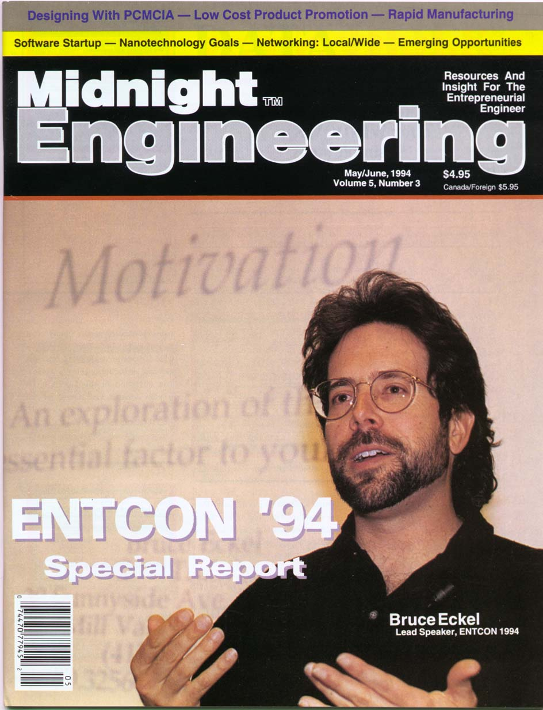
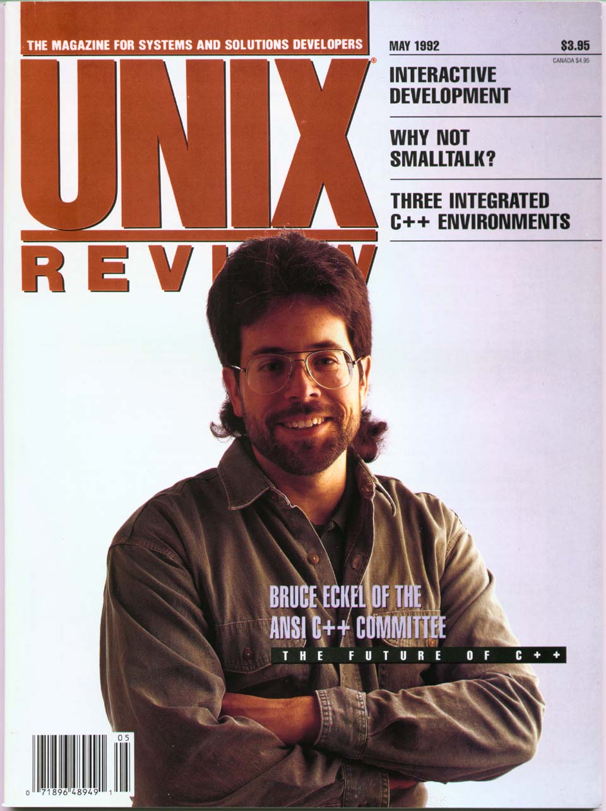

- Questions? Email Mindview <mindviewinc@gmail.com>
- [IRS Form W-9](W9.pdf)

 

# Biography



## Wikipedia Entry

- [Bruce Eckel](https://en.wikipedia.org/wiki/Bruce_Eckel)

## Publicity Photo

<table align="left">
<tr><td></td></tr>
<caption align="bottom">Right-click on image and choose "save as"</caption>
</table>

## Covers

Two magazine covers from the past.

+ Site built with
<a href="https://www.gohugo.io" target="_blank">Hugo</a>, using a theme derived from
<a href="http://github.com/digitalcraftsman/hugo-material-docs" target="_blank">Material</a>.

+ Graphics by <a href="http://www.Will-Harris.com">Daniel Will-Harris</a>

